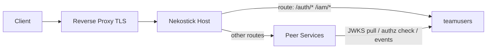
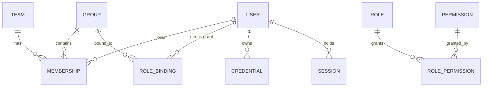

# PLAN — teamusers: Identity & Access Component

A standalone Go microservice that is the **single source of truth** for users, teams,
permission groups, and fully customizable permissions across the microservice fleet.
It owns all identity/authorization data and exposes authentication (token issuance)
and authorization (verification) interfaces for every other component. It deploys as
a local microservice behind **Nekostick** (dynamic routing host).

## 1. Goals & Non-Goals

### Goals

- Manage **Users**, **Teams**, **Groups**, **Roles**, and **Permissions** (full CRUD).
- Fully data-driven permission definitions: `resource:action:scope` strings with
  wildcard support, registered by the service itself or reported by peer services.
- **RBAC + ABAC**: role/group bindings plus attribute-based condition expressions.
- Issue and verify credentials: OIDC-style `access_token` (JWT, RS256/EdDSA) +
  `refresh_token`, JWKS endpoint for key distribution.
- Three authorization consumption paths for peer services: local SDK verification
  (primary), remote `/authz/check` API (fallback), event-driven cache invalidation.
- Audit log for every identity/permission mutation from day one.
- Deploy behind Nekostick as a supervised local microservice (HTTP/1.1, no TLS).

### Non-Goals

- No end-user login UI (API only; a console frontend is a separate project).
- No social/federated login providers in v1 (password + service credentials only;
  the OIDC token model leaves room to add them later).
- No TLS termination (Nekostick's boundary: an external reverse proxy owns TLS).
- No billing/quota/multi-region concerns.

## 2. Position in the Fleet



- Nekostick routes public traffic to this service by prefix; peer services call it
  over the internal network directly or via Nekostick routes.
- This service trusts `X-Forwarded-For` / `X-Real-IP` **only** because it is never
  exposed outside the Nekostick host boundary; bind to loopback/leased port only.
- Health checks (`GET /healthz`, `GET /readyz`) integrate with Nekostick's
  supervision and port-lease lifecycle; graceful drain on `SIGTERM`.

## 3. Tech Stack

| Concern | Choice | Rationale |
| --- | --- | --- |
| Language | Go 1.24+ | Fleet-standard performance; easy single-binary deploy |
| HTTP | `net/http` + `chi` | Boring, middleware-friendly |
| DB | PostgreSQL 16 via `pgx/v5` | Aligns with Nekostick infra; JSONB for ABAC conditions |
| Migrations | `goose` (embedded, runs at startup behind advisory lock) | Mirrors Nekostick's startup-coordination pattern |
| JWT | `lestrrat-go/jwx/v2` (JWKS server + client) | Maintained, JWKS-native |
| ABAC conditions | `expr-lang/expr` over a sandboxed context | No custom parser; deterministic, testable |
| Events | NATS JetStream (fallback: Postgres outbox table + poll) | At-least-once invalidation fan-out |
| Logging | `slog` JSON | Structured, grep-friendly |
| Config | env vars + `--` flags, CLI overrides env (Nekostick convention) | Consistent ops UX with the host |

## 4. Domain Model



### Entities

- **User** — identity only: id, username, email, display name, status
  (`active|disabled`), timestamps. **No permission fields on the user row.**
- **Credential** — password hash (argon2id) or service-account secret hash;
  separate table so rotation never touches the user row.
- **Team** — tenant/organization boundary. **Every authorization-relevant row
  carries `team_id`** (including `NULL` = platform scope) so multi-tenancy is
  structural, not retrofitted.
- **Group** — named collection of users within a team (e.g. "backend",
  "on-call"). Groups carry role bindings; users join via Membership.
- **Membership** — `(team_id, group_id, user_id)` with optional `expires_at`.
- **Role** — named set of permissions, scoped to a team or platform-wide.
- **Permission** — data row: `key` (`resource:action:scope`), description,
  `registered_by` (service name). Permissions are **data, not code**.
- **RoleBinding** — attaches a role to a group or directly to a user, with
  optional ABAC `condition` (expr) and `expires_at`.
- **Session** — refresh-token family: id, user, client fingerprint, expiry,
  revocation reason. Enables refresh rotation + reuse detection.
- **AuditLog** — append-only: actor, action, target, before/after diff JSONB,
  request id, timestamp.
- **OutboxEvent** — transactional outbox for permission-affecting changes.

### Effective permission set

```
effective(user, team) =
    union over direct user RoleBindings
  ∪ union over user's groups → their RoleBindings
  → expand Roles → Permission keys
  → drop bindings whose ABAC condition fails (evaluated at check time)
  → drop expired bindings / disabled users
```

Precedence rules (fixed, documented, tested):

1. Disabled user ⇒ empty set.
2. Explicit `deny` permission rows (key prefix `!`) beat allows — v1.1 feature;
   the evaluation pipeline reserves the ordering hook now.
3. Wildcard matching: `order:*:team` matches `order:read:team`;
   `*` only within one segment; no cross-segment globs.
4. Smaller scope wins on conflict once deny lands: `own` > `team` > `any`.

## 5. Permission String Grammar

```text
permission  = [ "!"(deny, v1.1) ] resource ":" action ":" scope
resource    = [a-z][a-z0-9_.-]*
action      = [a-z][a-z0-9_-]* | "*"
scope       = "own" | "team" | "any" | "*"
```

- Registration API (`POST /permissions`) lets peer services declare their keys at
  boot (idempotent upsert), so the admin console can enumerate everything
  assignable without hardcoding.
- Keys are validated against the grammar at write time; invalid keys rejected.

## 6. Authentication

### Flows

- **Password login**: `POST /auth/login` → verify argon2id → issue token pair.
  Rate-limited per IP+username; constant-time failure path.
- **Service accounts**: `POST /auth/client-credentials` → same token pair shape,
  `sub` = service account user id, marked `kind: service`.
- **Refresh**: `POST /auth/refresh` with rotation — old refresh token invalidated,
  reuse of a rotated token revokes the whole session family (theft detection).

### Access token (JWT, RS256 or EdDSA, 5–15 min TTL)

```json
{
  "iss": "teamusers",
  "sub": "usr_01J…",
  "team": "team_01J…",
  "kind": "user|service",
  "perm_ver": 42,
  "iat": 0, "exp": 0, "jti": "…"
}
```

- **Permissions are NOT embedded in the token** — token size explosion and
  un-revokeable staleness. Tokens prove identity only.
- `perm_ver` is a per-user monotonic counter bumped on any change affecting that
  user's effective set; SDKs compare it against their cache entry.
- Keys: private key never leaves this service; public keys served at
  `GET /.well-known/jwks.json` with `kid` rotation (overlap window ≥ 2× TTL).
- Introspection `POST /auth/introspect` for opaque validation (revocation-aware).

## 7. Authorization Interfaces (for peer services)

Three consumption paths, in order of preference:

1. **Local verification SDK (primary path)** — `sdk/go` first, then TS/Python:
   - Verifies JWT locally against cached JWKS (auto-refresh on `kid` miss).
   - Caches `user_id → (perm_ver, effective permission set)` in-process,
     TTL 1–5 min, invalidated by events and `perm_ver` mismatch.
   - `Require("order:read:team")` middleware/helpers; matching is pure in-memory.
   - ABAC conditions ship in the cached set as compiled expr programs; evaluated
     against request context (`resource.owner_id`, `request.time`, etc.).
2. **Remote check (fallback / sensitive ops)**:
   `POST /authz/check { subject, permission, context }` → `{ allow, reason }`.
   Authoritative, no cache trust required; p99 budget 20 ms on the service.
3. **Events**: `perm.changed`, `user.disabled`, `role.updated`, `key.rotated`
   published via outbox → JetStream; SDK subscribers drop affected cache entries.

Revocation semantics (documented honestly): disable/revoke takes effect within
`min(access_token_TTL, cache_TTL)`; events narrow that to seconds in practice.
`/authz/check` is always immediate.

## 8. HTTP API Surface

### Runtime plane (consumed by services & clients)

```text
GET  /.well-known/jwks.json          public keys
POST /auth/login                     password login
POST /auth/client-credentials        service login
POST /auth/refresh                   rotate refresh token
POST /auth/logout                    revoke session family
POST /auth/introspect                token introspection
POST /authz/check                    remote authorization check
GET  /authz/permissions/:userId      effective set + perm_ver (SDK cache fill)
GET  /healthz /readyz                Nekostick supervision
```

### Admin plane (consumed by console; protected by platform-scope permissions)

```text
/users            GET POST GET:id PATCH:id DELETE:id   (+ /users/:id/disable)
/teams            full CRUD
/groups           full CRUD   + /groups/:id/members    (PUT/DELETE membership)
/roles            full CRUD   + /roles/:id/permissions (PUT set)
/permissions      GET POST    (registration & listing; immutable keys)
/bindings         POST DELETE (role → group|user, with optional condition)
/audit            GET (filterable, paginated)
```

Conventions: `Id`-prefixed ULIDs, RFC 9457 problem+json errors, cursor
pagination, `Idempotency-Key` honored on all POSTs, admin endpoints themselves
gated through the same permission engine (dogfooding, keys under
`iam:*`).

## 9. Database Schema (PostgreSQL)

Core tables (`team_id` everywhere authz-relevant; `NULL` = platform scope):

```text
users(id, username CITEXT UNIQUE, email CITEXT, display_name, status, perm_ver BIGINT, created_at, updated_at)
credentials(user_id FK, kind, hash, created_at, rotated_at)
teams(id, slug UNIQUE, name, status, created_at)
groups(id, team_id FK, name, UNIQUE(team_id, name))
memberships(team_id, group_id FK, user_id FK, expires_at, PRIMARY KEY(group_id, user_id))
permissions(key PK, description, registered_by, created_at)
roles(id, team_id FK NULL, name, UNIQUE(team_id, name))
role_permissions(role_id FK, permission_key FK, PRIMARY KEY(role_id, permission_key))
role_bindings(id, team_id, role_id FK, subject_kind ENUM(group,user), subject_id, condition TEXT NULL, expires_at NULL)
sessions(id, user_id FK, family_id, client_meta JSONB, expires_at, revoked_at, revoke_reason)
audit_log(id BIGSERIAL, team_id, actor_id, action, target, diff JSONB, request_id, at)
outbox(id BIGSERIAL, topic, payload JSONB, published_at NULL)
permission_registry_meta(singleton row: global perm epoch, for cache warm-up)
```

Indexes: `memberships(user_id)`, `role_bindings(subject_kind, subject_id)`,
`audit_log(team_id, at DESC)`, `outbox(published_at) WHERE published_at IS NULL`.

## 10. Consistency & Caching

- All mutations run in a transaction that also writes the outbox row and bumps
  affected users' `perm_ver` (via membership/binding fan-out query).
- A relay goroutine publishes unpublished outbox rows to JetStream
  (at-least-once; consumers idempotent by event id).
- SDK cache entry: `{ perm_ver, expires_at, map[permission]condition? }`.
  Serve while fresh and `perm_ver` matches the token; else refetch
  `/authz/permissions/:userId`.
- Cold-start behavior: JWKS fetch retries with backoff; authz fails closed
  (deny) until keys are available.

## 11. Security Hardening

- argon2id (OWASP params), secrets hashed, never logged; config redaction in
  `status`-style diagnostic output.
- Login throttling + optional TOTP hook point (v1.1).
- ABAC expr sandbox: no IO functions, bounded execution time, max AST depth.
- Bind to `127.0.0.1` / leased port; only Nekostick may route to it.
- Request-size limits, timeouts, and `Idempotency-Key` store (24 h).
- Key rotation procedure documented; `key.rotated` event forces SDK JWKS refresh.
- Audit log is append-only (DB role lacks UPDATE/DELETE on it).

## 12. Deployment (Nekostick child process)

Nekostick supervises microservices as local child processes; this service ships
as a single static binary (`CGO_ENABLED=0 go build`, linux/amd64) deployed to
nodes by a deployment extension. No Dockerfile/systemd unit: the supervisor
owns the process lifecycle.

- **Process contract**: Nekostick injects `PORT` + `HOST` env into the child;
  the service binds exactly those (precedence: CLI > `TEAMUSERS_LISTEN_*` >
  `PORT`/`HOST` > default). Upstream is `http://$HOST:$PORT`.
- **Service definition**: `FileName=<binary>`, `ArgumentList=["run"]`,
  `Environment` carries `TEAMUSERS_CONNECTION_STRING`/`TEAMUSERS_KEY_DIR`/NATS and
  webhook knobs. Secrets in service Environment are stored plaintext in
  Nekostick's PG config — treat Host Config API read access as high-sensitivity.
- **Lifecycle**: start mode Eager (auth is on every service's critical path;
  Lazy would stall first requests). Supervisor SIGTERMs the process group with
  a 15 s grace (our drain is 10 s). Restart OnFailure with backoff is the
  supervisor's job.
- **Health**: Http check `GET /healthz` for startup + steady state.
- **Config**: env vars + `--` flags, CLI overrides env (Nekostick convention).
- Startup: advisory-lock migration → key load/generate → `/readyz` flips green
  only after DB writable; routes: register `/.well-known/jwks.json`, `/auth/*`,
  `/authz/*` and admin prefixes with `forwardingMode=Preserve` (this API is
  root-relative; there is no base-path support).

## 13. Project Layout

```text
cmd/teamusers/          entrypoint (run/status/doctor)
internal/
  config/               env+flag loading, redaction
  domain/               entities, permission grammar, evaluation engine
  store/                pgx queries, migrations (goose embed)
  authn/                argon2, token issue/rotate, JWKS
  authz/                effective-set resolver, ABAC expr eval, /authz/check
  httpapi/              chi routers (runtime plane, admin plane), middleware
  events/               outbox relay, JetStream publisher
  audit/                append-only writer
sdk/go/                 local verification SDK (JWKS cache, perm cache, middleware)
docs/                   API reference, ops runbook, Nekostick integration
PLAN.md                 this file
```

## 14. Milestones

1. **M1 — Skeleton & data plane**: config/CLI, migrations, CRUD for
   users/teams/groups/roles/permissions, audit writes. Acceptance: full CRUD via
   API against real Postgres; audit rows for every mutation.
2. **M2 — AuthN**: login, refresh rotation + reuse detection, JWT issue, JWKS
   endpoint, introspect. Acceptance: token pair lifecycle end-to-end; JWKS
   rotation drill passes.
3. **M3 — AuthZ engine**: effective-set resolver, wildcard matcher, ABAC expr
   conditions, `/authz/check`, `/authz/permissions/:userId`, perm_ver bumps.
   Acceptance: evaluation-precedence test matrix green; p99 check < 20 ms local.
4. **M4 — Go SDK + events**: outbox relay, JetStream topics, SDK with JWKS/perm
   caches and middleware. Acceptance: a demo service behind the SDK denies/allows
   correctly; permission change propagates to SDK cache in < 5 s via event.
5. **M5 — Deployment**: binary + image, Nekostick route + health integration,
   `doctor`, ops runbook. Acceptance: `SIGTERM` drains cleanly under Nekostick
   supervision; fresh-boot readiness gate verified.
6. **M6 — v1.1 backlog hooks**: deny precedence, TOTP, TS/Python SDKs.

## 15. Testing Strategy

- Unit: permission grammar, wildcard matcher, precedence matrix (table-driven),
  expr sandbox limits, refresh-rotation state machine.
- Integration (real Postgres, testcontainers-go; **no in-memory substitute**):
  CRUD + audit, resolver fan-out, outbox relay.
- Contract: JWKS format, problem+json shapes, event payload versioning.
- Smoke: Nekostick service entity + route → login → SDK-guarded demo service →
  permission revoke → observe denial within event latency.

## 16. Risks & Open Questions

- **Cache staleness vs revocation promises**: mitigated by short TTL + events +
  `perm_ver`, but docs must state "seconds, not instant" except `/authz/check`.
- **ABAC expr injection surface**: sandbox + depth/time limits; conditions are
  admin-written, never client-supplied at check time beyond the documented
  context schema.
- **perm_ver fan-out cost** on bulk role edits: batch updates; measure in M3.
- **Decided**: no SMTP/email in this service. Notification-style events
  (`user.created`, `password.reset_requested`, …) are delivered as HMAC-signed
  outbound **webhooks** to configurable endpoints; consumers own delivery.
- **Decided**: no admin console UI in this repo; the admin plane HTTP API is the
  management interface. A console may consume it later as a separate project.
